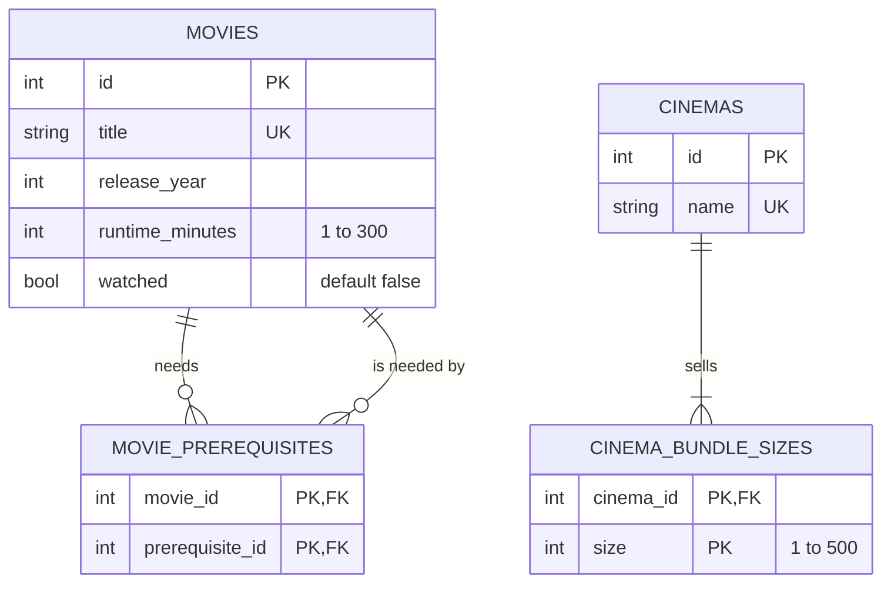

# Doomsday Ready

## Data model

```mermaid
erDiagram
    MOVIES ||--o{ MOVIE_PREREQUISITES : "needs"
    MOVIES ||--o{ MOVIE_PREREQUISITES : "is needed by"
    CINEMAS ||--|{ CINEMA_BUNDLE_SIZES : "sells"

    MOVIES {
        int id PK
        string title UK
        int release_year
        int runtime_minutes "1 to 300"
        bool watched "default false"
    }
    MOVIE_PREREQUISITES {
        int movie_id PK, FK
        int prerequisite_id PK, FK
    }
    CINEMAS {
        int id PK
        string name UK
    }
    CINEMA_BUNDLE_SIZES {
        int cinema_id PK, FK
        int size PK "1 to 500"
    }
```
